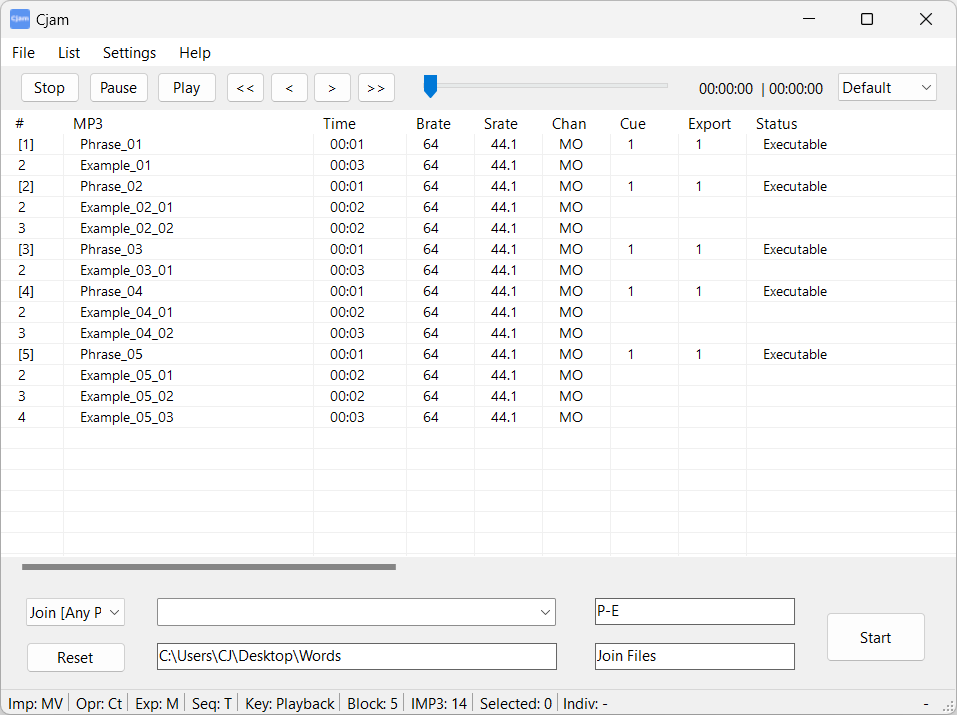

# Cjum

## Overview
**Cjum** (pronounced "see-jum") is a simple MP3 file editing software designed for Windows PCs. Files are imported by dragging and dropping them onto the interface, after which they can be processed and exported according to the specified settings. Operations can be defined using text input, allowing multiple independent actions to be executed sequentially. The software enables fast file editing without the need for decoding and re-encoding the audio.  

## Key Features  
- Cut MP3 files  
- Join MP3 files  
- Add fade effects to MP3 files  
- Add silent intervals to MP3 files  
- Play MP3 files  
- Operate using text commands  
- Save settings  

## Download
You can download the latest version of Cjum from the links below:

### English Version
[Download Cjum (English)](https://github.com/cutandjoin/Cjum/releases/download/cjum1850/cjum_v1850e.zip)

**Version**: 1.8.5.0  
**Release Date**: December 14, 2024  
**File Size**: 1.19 MB  
**SHA-256**: 75f7a860a5f8d03060319463f6795b8e711b872c3267abc4fed6fbb518c5a1d2  

### Japanese Version
[Download Cjum (日本語)](https://github.com/cutandjoin/Cjum/releases/download/cjum1850j/cjum_v1850j.zip)

**Version**: 1.8.5.0  
**Release Date**: December 14, 2024  
**File Size**: 1.19 MB  
**SHA-256**: 19db7aec77ff4d3b20482ed53a4639b5686ecc603ad00990bb4e1c3d798d5567

## Supported Devices
Cjum requires a PC with the following software installed:

- Microsoft Windows 10 or later
- Microsoft .NET 6.0 or later

## Supported File Formats
- MP3 (*.mp3)
- CUE (*.cue)
- M3U (*.m3u)
- CJUMC (*.cjc) - Cjum's custom format
- CJUMJ (*.cjj) - Cjum's custom format
- CJUM (*.cjm) - Cjum's custom format

## Installation and Execution
1. Extract the ZIP file and place the "Cjum" folder on a drive with read/write access.
2. Run "Cjum.exe" to start the software.

## Changelog

### Version 1.0.0.0 - December 21, 2019
- Initial release

### Version 1.8.0.0 - September 23, 2024
- English version release

### Version 1.8.1.0 - September 30, 2024
- Bug fixes

### Version 1.8.2.0 - October 1, 2024
- Bug fixes

### Version 1.8.3.0 - October 2, 2024
- Bug fixes

### Version 1.8.4.0 - October 6, 2024
- Bug fixes

### Version 1.8.5.0 - December 14, 2024
- New features added
- Bug fixes
