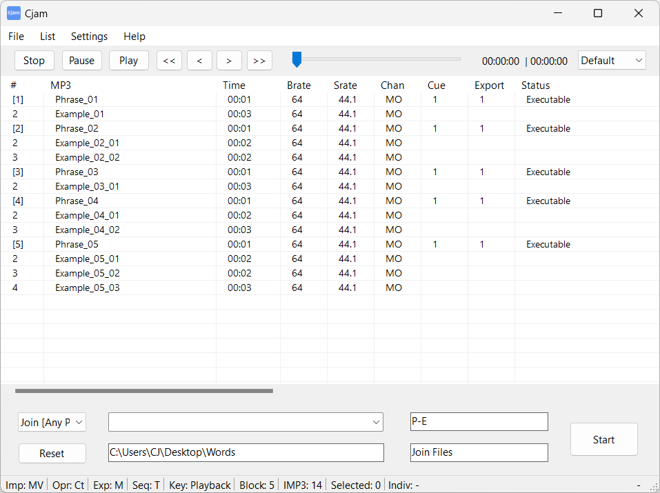

# Cjam

## Overview
**Cjam** is non-destructive MP3 editing software designed for Windows PCs. Files are imported by dragging and dropping them onto the interface, after which they can be processed and exported according to the specified settings. Operations can be defined using text input, allowing multiple independent actions to be executed sequentially. The software enables fast editing without the need for decoding and re-encoding the audio.

## Key Features
- Cut MP3 files
- Join MP3 files
- Add fade effects to MP3 files
- Add silent intervals to MP3 files
- Play MP3 files
- Operate using text commands
- Save settings

## Download

### [Download Cjam](https://github.com/cutandjoin/Cjam/releases/download/v2610/cjam_v2610.zip)

**Version**: 2.6.1.0  
**Release Date**: Aug 22, 2026  
**File Size**: 53.8 MB  
**SHA-256**: 6c9ecdb6c68e8838a99a5100d48f19eff837aead1b3b3c8d77b2fa0d0d6b348d

Includes the .NET 8 runtime. No additional software is required.

If the latest version cannot be downloaded, the previous version is available [here](https://github.com/cutandjoin/Cjam/releases/download/v2600/cjam_v2600.zip).

For more information, see the <a href="https://forum.cjmapp.net/index.php">forum</a>.

## Alternative Downloads

### Framework-dependent (.NET 8)

Requires Microsoft .NET 8 Runtime.

[Download](https://github.com/cutandjoin/Cjam/releases/download/v2610/cjam_v2610_net8.zip)

**File Size**: 1.47 MB  
**SHA-256**: 7997fadb5dfa003bf4d3039a2aec293b3b21a7dbd4c550565d8a20adb139e84d

### Framework-dependent (.NET 6)

Requires Microsoft .NET 6 Runtime.

[Download](https://github.com/cutandjoin/Cjam/releases/download/v2610/cjam_v2610_net6.zip)

**File Size**: 1.47 MB  
**SHA-256**: 1e5b691edbc7c5bf3171c9fb97e1e457c89af79eae82edd977bd5034065466e3

## Supported Devices

- Microsoft Windows 10 or later

## Supported File Formats

- MP3 (*.mp3)
- CUE (*.cue)
- M3U (*.m3u)
- CJAMC (*.cjc) - Cjam's custom format
- CJAMJ (*.cjj) - Cjam's custom format
- <a href="https://cjmapp.net/manual/manual.html#txt-cjm">CJAM</a> (*.cjm) - Cjam's custom format
- <a href="https://cjmapp.net/manual/manual.html#txt-txt">TXT</a> (*.txt)

## Installation and Execution

1. Extract the ZIP file.
2. Place the "Cjam" folder on a drive with read/write access.
3. Run "Cjam.exe".

## Changelog

### Version 1.0.0.0 - Dec 21, 2019

### Version 2.0.0.0 - Jun 28, 2025

### Version 2.6.1.0 - Aug 22, 2026
- Added a new value to the command parameter (qd)
- Added new command parameters (qti, qte)
- Added a new command alias (reftag)
- Added support for new ID3 tag fields (e.g., Album Artist, Track Number)
- Added Undo/Redo menus to the vmp3 screen
- Fixed a bug where the ri parameter was incorrectly applied when reassigning
- Added lang.txt entries (vmp_m030-vmp_m055, pli_c471)

For detailed update information, see the <a href="https://forum.cjmapp.net/viewforum.php?f=3">full changelog</a>.
