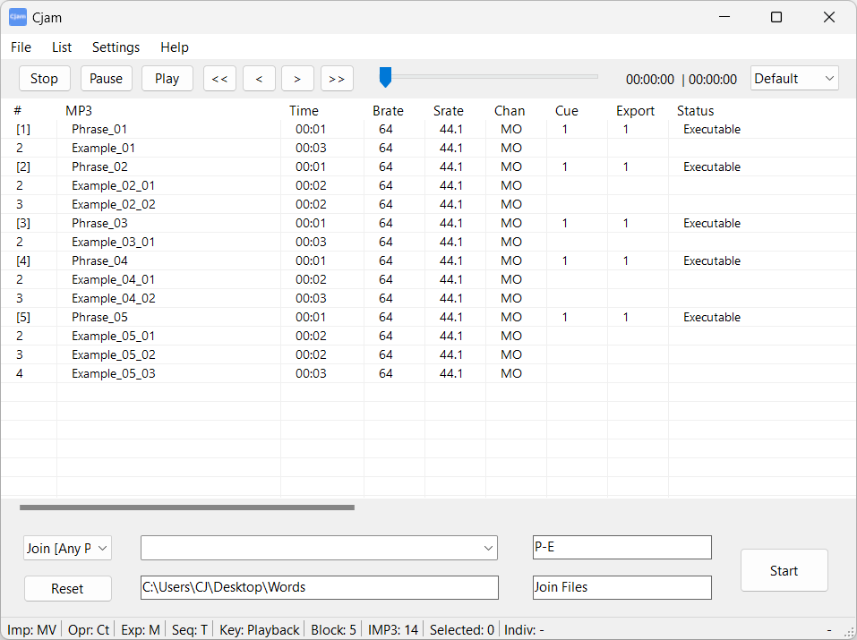

# Cjam

## Overview
**Cjam** is non-destructive MP3 editing software designed for Windows PCs. Files are imported by dragging and dropping them onto the interface, after which they can be processed and exported according to the specified settings. Operations can be defined using text input, allowing multiple independent actions to be executed sequentially. The software enables fast editing without the need for decoding and re-encoding the audio.

## Key Features
- Cut MP3 files
- Join MP3 files
- Add fade effects to MP3 files
- Add silent intervals to MP3 files
- Play MP3 files
- Operate using text commands
- Save settings

## Download

### [Download Cjam](https://github.com/cutandjoin/Cjam/releases/download/v2730/cjam_v2730.zip)

**Version**: 2.7.3.0  
**Release Date**: Sep 28, 2026  
**File Size**: 54.4 MB  
**SHA-256**: c5e955162975c66a5febde032eae19a80ee2a2dd789ee52630836527d561129b

Includes the .NET 8 runtime. No additional software is required.

If the latest version cannot be downloaded, the previous version is available [here](https://github.com/cutandjoin/Cjam/releases/download/v2720/cjam_v2720.zip).

For more information, see the <a href="https://forum.cjmapp.net/index.php">forum</a>.

Resources for multiple languages are available <a href="https://forum.cjmapp.net/viewforum.php?f=10">here</a>.

## Alternative Downloads

### Framework-dependent (.NET 8)

Requires Microsoft .NET 8 Runtime.

[Download](https://github.com/cutandjoin/Cjam/releases/download/v2730/cjam_v2730_net8.zip)

**File Size**: 2.09 MB  
**SHA-256**: 9517278c3cce8b53ef44fa0568fa759988eaaf130cf8739de5bf31a64d361dd9

### Framework-dependent (.NET 6)

Requires Microsoft .NET 6 Runtime.

[Download](https://github.com/cutandjoin/Cjam/releases/download/v2730/cjam_v2730_net6.zip)

**File Size**: 2.09 MB  
**SHA-256**: a272cbcc64b7728bcb67006657e4d05b4b38920d641fb871e6c5266d6264bae6

## Supported Devices

- Microsoft Windows 10 or later

## Supported File Formats

- MP3 (*.mp3)
- CUE (*.cue)
- M3U (*.m3u)
- CJAMC (*.cjc) - Cjam's custom format
- CJAMJ (*.cjj) - Cjam's custom format
- <a href="https://cjmapp.net/manual/manual.html#txt-cjm">CJAM</a> (*.cjm) - Cjam's custom format
- <a href="https://cjmapp.net/manual/manual.html#txt-cjt">CJAMT</a> (*.cjt) - Cjam's custom format
- TXT (*.txt)

## Installation and Execution

1. Extract the ZIP file.
2. Place the "Cjam" folder on a drive with read/write access.
3. Run "Cjam.exe".

## Changelog

### Version 1.0.0.0 - Dec 21, 2019

### Version 2.0.0.0 - Jun 28, 2025

### Version 2.7.3.0 - Sep 28, 2026
- Added a new value to the command parameter (ld)
- Added new command parameter (lw)
- Added new command aliases (e.g., selectnumber)
- Added support for new section types in .cjt/.txt files (Reference)
- Added support for labels in .cjt/.txt sections 
- Added new built-in Lua properties and functions for Lua sections in .cjt/.txt files (e.g., vmtext, readsection)
- Added new lang.txt entries (pli_c472–pli_c474)
- Posted text for several language files on the forum

For detailed update information, see the <a href="https://forum.cjmapp.net/viewforum.php?f=3">full changelog</a>.
